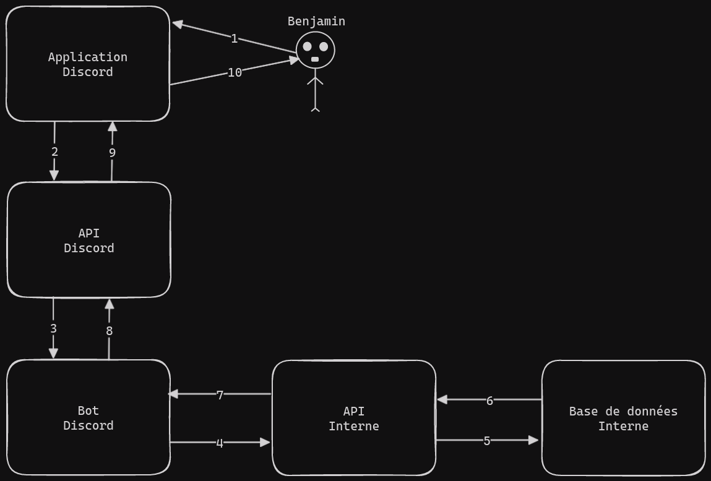

# API d'enregistrement d'informations de serveur Discord

Vous devez créer une API pour permettre à des Bots Discord d'enregister les informations d'un Serveur Discord, dans le but d'utiliser ces informations ultérieurement.

## Architecture

## Spécifications fonctionnelles

- L'API doit permettre d'enregistrer toutes les informations d'une guild Discord.
- L'API doit permettre d'enregistrer toutes les informations des membres de cette guild.

## Spécifications techniques

- Les réponses de l'API doivent être normalisées de façon automatique[¹](#explain).
- Les erreurs d'accession aux données via `Prisma` doivent être automatiquement gérées et renvoyer des réponses claires expliquant la raison de l'erreur sans encombrer les logs de l'API en plus, le code de statut de la réponse doit être celui qui correspond à l'erreur survenue. Vous devez coder ce système grâce à un intercepteur.

### Annexes

¹ : Pour ce faire vous devez utiliser un intercepteur et coder un système qui crée un message cohérent en fonction du contexte et qui normalise automatiquement la réponse.

### Termes techniques

- `Guild` : Le terme Guild signifie `Serveur Discord`.