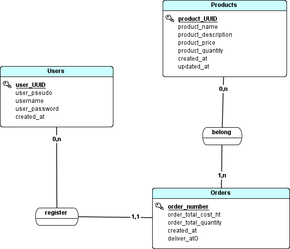
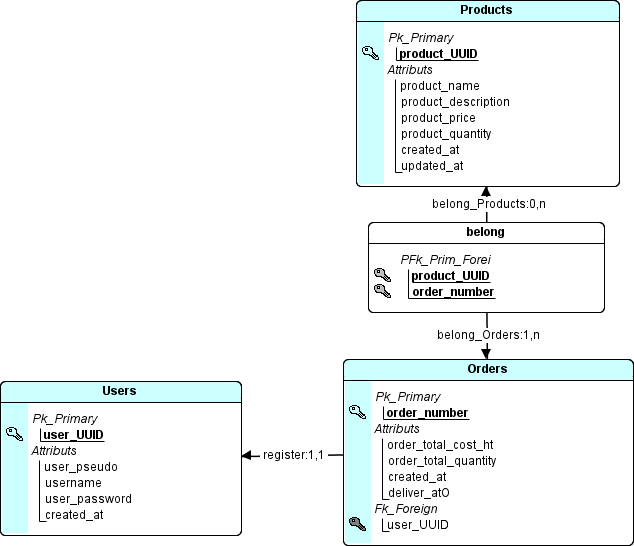

# API d'e-commerce

Vous devez créer une API d'e-commerce pour permettre à des utilisateurs de commander des articles.

## Spécifications fonctionnelles

### Utilisateurs

- Les Utilsateurs doivent être composés des champs :
  - UUID (De type VARCHAR de longueur 36 (minimale et maximale))
  - Un pseudo (De type VARCHAR de longueur 20 (maximale))
  - Un nom d'utilisateur (De type VARCHAR de longueur 30 (maximale))
  - Un mot de passe (De type VARCHAR de longeur 72 (minimale et maximale))
  - Une date de création (De type DATE)
- Les Utilisateurs doivent être authentifiés afin d'effectuer des commandes sur les produits.

### Produits

- Les produits doivent être composés des champs :
  - UUID (De type VARCHAR de longueur 36 (minimale et maximale))
  - Un nom (De type VARCHAR de longueur 20 (maximale))
  - Une description (De type LONGTEXT de longueur 500 (maximale))
  - Un prix unitaire (De type FLOAT)
  - Une quantité (De type INT >= 1)
  - Une date d'ajout (De type DATE)
  - Une date de mise à jour (De type DATE)

### Commandes

- Les commandes doivent être composées des champs :
  - Un numéro de commande (De type INT en auto-increment)
  - L'UUID d'un Client
  - L'UUID d'un Produit
  - Une quantité de produit (De type INT >= 1)
  - Un prix total (HT)
  - Une date de création (De type DATE)
  - Une date d'expédition (De type DATE)

## Merise

### MCD

### MLD

